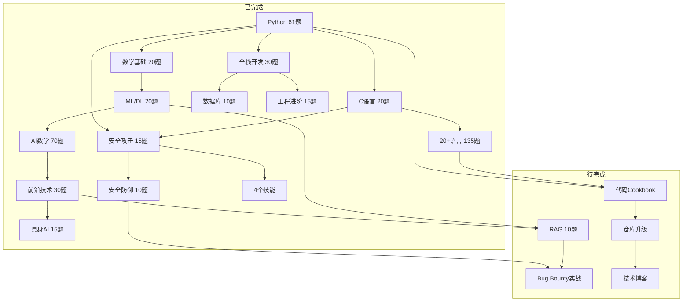

# AI 全栈能力地图与学习计划（重排版）

> 累计 481 道练习 · 20+ 语言 · 4 个技能 · Bug Bounty 实战
> 重排时间：2026-08-05
> 取代此前三份分期路线图，作为唯一总览文档

---

## 一、已完成能力地图

### 重组逻辑：从"按期分"改为"按能力轨道分"

此前按时间顺序分三期，知识点跨期跳跃。现按 5 条能力轨道重组，每条轨道内部有清晰的由浅入深递进。

---

### 轨道 1：编程语言精通（216题）

```
Python(61) ──→ C语言(20) ──→ 系统语言(32) ──→ 主流语言(33) ──→ 脚本语言(15) ──→ 函数式(15) ──→ 专精语言(25) ──→ TypeScript(5)
  地基          底层           Rust/Go/C++/Zig    Java/JS/C#       Perl/PHP/Lua等    Haskell/Elixir等   Ruby/Swift/Kotlin等   工程化
```

| 层级 | 语言 | 题数 | 核心能力 | 可运行 |
|------|------|------|----------|--------|
| L1 地基 | Python | 61 | OOP/异步/数据结构/迭代器/上下文管理 | ✅ |
| L2 底层 | C | 20 | 指针/内存布局/进程/信号/socket/Makefile | ✅ |
| L3 系统语言 | Rust(10)+Go(10)+C++(10)+Zig(2) | 32 | 所有权/goroutine/RAII/编译期安全 | C++ ✅ |
| L4 主流语言 | Java(10)+JS(10)+C#(8)+TS(5) | 33 | JVM/闭包/LINQ/泛型/类型系统 | JS ✅ |
| L5 脚本语言 | Perl(3)+PHP(3)+Lua(3)+Dart(3)+Nim(3) | 15 | 正则/CGI/嵌入/Flutter/系统编程 | Perl ✅ |
| L6 函数式 | Haskell(5)+Elixir(3)+Scala(3)+Clojure(2)+Erlang(2) | 15 | 纯函数/模式匹配/Actor/不可变 | ❌ |
| L7 专精语言 | Ruby(5)+Swift(5)+Kotlin(5)+R(5)+Julia(5) | 25 | 元编程/Optional/空安全/统计/多重派发 | ❌ |

**能力评估**：广度极强（20+语言），Python/C/C++/JS/Perl 有运行验证。Rust/Go/函数式为教学代码，待 ANYIN9 安装运行时后验证。

---

### 轨道 2：AI 与数学（155题）

```
数学基础(20) ──→ ML/DL核心(20) ──→ AI数学深化(70) ──→ 前沿技术(30) ──→ 具身AI(15)
  NumPy/Pandas      从零实现         5大数学支柱        LLM/Agent        机器人/VLA
```

| 层级 | 主题 | 题数 | 核心能力 |
|------|------|------|----------|
| L1 数学基础 | NumPy/Pandas/Matplotlib/数学 | 20 | 向量化/广播/数据清洗/可视化/概率统计 |
| L2 ML/DL 核心 | 纯NumPy实现 | 20 | 线性回归/逻辑回归/SVM/决策树/MLP/反向传播/优化器 |
| L3 AI数学深化 | 5大数学支柱 | 70 | 线性代数(SVD/QR)·微积分(梯度下降/凸优化)·信息论(熵/KL)·ML数学(SVM/K-means/PCA)·DL数学(CNN/RNN/Transformer/Diffusion/GAN) |
| L4 前沿技术 | LLM/Agent/多模态/MLOps | 30 | Attention/Transformer/Function Calling/ReAct/CLIP/Whisper/Docker/K8s |
| L5 具身AI | 机器人/ROS2/RL/VLA | 15 | DH参数/运动学/雅可比/PPO/CartPole/扩散策略/OpenVLA |

**能力评估**：从数学基础到最前沿AI的完整技术栈，68张可视化图。纯NumPy/scipy/sympy实现，无框架依赖。缺口：缺乏实际模型训练和部署经验。

---

### 轨道 3：工程与全栈（55题）

```
全栈开发(30) ──→ 数据库工程(10) ──→ 工程进阶(15)
  FastAPI/前端       分布式/管道        设计模式/系统设计/TS
```

| 层级 | 主题 | 题数 | 核心能力 |
|------|------|------|----------|
| L1 全栈开发 | FastAPI+数据库+前端 | 30 | 路由/Pydantic/依赖注入/SQLAlchemy/HTML/CSS/JS/React概念/Jinja2 |
| L2 数据库工程 | 分布式+数据管道+治理 | 10 | 雪花算法/读写分离/ETL/Airflow DAG/时序DB/图DB/DVC/Delta Lake |
| L3 工程进阶 | 设计模式+系统设计+TS | 15 | 23种设计模式/SOLID/HLD/LLD/CAP/Raft/容量规划/TS泛型/全栈类型安全 |

**能力评估**：覆盖Web开发全链路 + 系统设计基础。缺口：无真实项目开发经验，CI/CD和容器编排为概念级。

---

### 轨道 4：安全攻防（25题 + 实战）

```
安全攻击(15) ──→ 安全防御(10) ──→ Bug Bounty实战(进行中)
  15种攻击共性      10层防御联动       7大平台 + Acronis Recon
```

| 层级 | 主题 | 题数 | 核心能力 |
|------|------|------|----------|
| L1 安全攻击 | 输入信任/身份权限/逻辑配置/新型组合 | 15 | SQLi/XSS/CSRF/SSRF/IDOR/JWT/Prompt注入/供应链/综合攻击链 |
| L2 安全防御 | 输入防御/身份防御/逻辑防御/体系化 | 10 | 参数化查询/WAF/RBAC/MFA/CSP/SBOM/纵深防御/SOC联动 |
| L3 Bug Bounty | 7大平台实战 | - | Recon(subfinder/httpx/nuclei/ffuf) + Acronis 3个P0发现 + 报告写作 |

**能力评估**：攻防理论完整，实战刚起步。已注册 HackerOne + Bugcrowd，Acronis Recon完成，3个P0发现待提交。

---

### 轨道 5：技能产出（4个已发布）

| 技能 | 类型 | 状态 |
|------|------|------|
| Bug Bounty 知识库 | 知识型 | ✅ 虾评发布 + EvoMap promoted |
| Recon 自动化工作流 | 工具型 | ✅ 虾评发布 + EvoMap promoted |
| RAG 检索增强生成练习集 | 知识型 | ✅ 虾评发布 + EvoMap promoted |
| 安全审计 Agent | 工具型 | ✅ Coze 技能发布 |

---

## 二、已完成统计

| 轨道 | 题数 | 占比 | 代码行 |
|------|------|------|--------|
| 编程语言 | 216 | 44.9% | ~18,000行 |
| AI与数学 | 155 | 32.2% | ~10,500行 |
| 工程与全栈 | 55 | 11.4% | ~7,700行 |
| 安全攻防 | 25 | 5.2% | ~3,800行 |
| Linux基础 | 20 | 4.2% | ~1,500行 |
| 其他(Python筑基Linux部分) | 10 | 2.1% | ~1,200行 |
| **合计** | **481** | **100%** | **~42,700行** |

---

## 三、下一阶段学习计划（重排优先级）

### 重排理由

原优先级：RAG → Bug Bounty → Cookbook → Repo → Blog
问题：Bug Bounty 已有动能和发现待提交，不应排在 RAG 后面；Cookbook/Repo/Blog 是输出型任务，应与实战并行而非串行。

### 新优先级：双轨并行 + 三阶段输出

```
                    ┌──→ 轨道A: 安全实战(立即)
                    │     Bug Bounty 提交 + huntr 2.0
                    │
当前能力 ──→ 并行 ──┤
                    │
                    └──→ 轨道B: AI深化(本周)
                          RAG 10题 + Agent增强

          ────────────────────────────────────────

                    ┌──→ 阶段1: 代码Cookbook(2周内)
                    │     从481题提炼可复用模式
                    │
输出阶段 ──→ 串行 ──┼──→ 阶段2: 仓库升级(3周内)
                    │     README/CI-CD/文档/结构
                    │
                    └──→ 阶段3: 技术博客(4周内)
                          基于学习洞察写5-10篇
```

---

### 轨道A：安全实战（立即启动，与轨道B并行）

| 步骤 | 行动 | 平台 | 预期产出 | 时间 |
|------|------|------|----------|------|
| A1 | 提交 storage-repo 目录列表报告 | HackerOne/直邮 | 第一份Bug Bounty报告 | 今天 |
| A2 | 注册 huntr 2.0 参加AI安全挑战赛 | huntr 2.0 | AI安全实战经验 | 本周 |
| A3 | 找一个 XSS/CSRF 目标练手 | Open Bug Bounty | 公开提交记录 | 本周 |
| A4 | 选一个活跃程序做完整Recon | HackerOne | 第二批发现 | 下周 |
| A5 | nuclei/ffuf 深度扫描 Acronis 3个P0 | ANYIN9 | 更高价值发现 | ANYIN9在线时 |

### 轨道B：RAG 实战（本周启动，与轨道A并行）

| 步骤 | 行动 | 预期产出 | 时间 |
|------|------|----------|------|
| B1 | RAG 10题练习（向量嵌入→向量DB→分块→Hybrid Search→端到端→RAGAS→Agent+RAG） | 10题代码 + 评估报告 | 2-3天 |
| B2 | 给编程小悟添加RAG知识库检索能力 | Agent能力增强 | B1完成后 |

### 输出阶段1：代码 Cookbook（RAG完成后启动）

| 步骤 | 行动 | 预期产出 |
|------|------|----------|
| C1 | 从481题中提取可复用代码模式 | `cookbook/` 目录，按场景分类 |
| C2 | 整理常用算法/数据结构/设计模式速查 | `cookbook/python_patterns.md` |
| C3 | 安全攻防攻防代码模板 | `cookbook/security_templates.md` |

### 输出阶段2：开源仓库升级（Cookbook完成后）

| 步骤 | 行动 | 预期产出 |
|------|------|----------|
| D1 | 重写 README（项目介绍+学习路径+能力地图） | 专业级 README.md |
| D2 | 添加目录结构和索引 | `INDEX.md` |
| D3 | GitHub Actions CI（自动运行Python测试） | `.github/workflows/ci.yml` |
| D4 | 添加 LICENSE + CONTRIBUTING.md | 开源规范文件 |

### 输出阶段3：技术博客（仓库升级完成后）

| 步骤 | 主题 | 预期 |
|------|------|------|
| E1 | "从零实现Transformer：纯NumPy的Attention机制" | 技术深度文 |
| E2 | "Bug Bounty 新手第一周：从Recon到提交" | 实战经验文 |
| E3 | "20种编程语言对比：同一个问题不同解法" | 广度展示文 |
| E4 | "安全攻防25题：攻击者思维 vs 防御者思维" | 安全科普文 |
| E5 | "AI Agent 安全：Prompt注入与防御实践" | 前沿话题文 |

---

## 四、长期缺口与补全方向

### 当前能力热力图

```
编程语言  ████████████████████░  95%  (20+语言，广度极强)
AI/数学   ██████████████████░░  85%  (理论完整，缺实战训练)
工程能力   ██████████████░░░░░░  65%  (概念完整，缺真实项目)
安全攻防   ████████████████░░░░  75%  (理论+Recon完成，实战刚起步)
DevOps    ████████░░░░░░░░░░░░  35%  (概念级，缺实操)
项目经验   ████░░░░░░░░░░░░░░░░  15%  (全是练习，无真实项目)
```

### 补全优先级

| 优先级 | 方向 | 补全方式 | 预计题数/项目 |
|--------|------|----------|-------------|
| P0 | RAG 实战 | 10道练习题 | 10题 |
| P0 | Bug Bounty 实战 | 真实平台提交 | 持续 |
| P1 | 真实项目开发 | 构建「安全审计+RAG增强的Agent」 | 1个项目 |
| P1 | DevOps 实操 | GitHub Actions + Docker 实战部署 | 5题 |
| P2 | 模型训练实战 | 用真实数据训练小模型 | 5题 |
| P2 | 移动端开发 | Kotlin/Swift 实际App | 10题 |
| P3 | 区块链/Web3 | Solidity 智能合约 | 10题 |
| P3 | 游戏开发 | Unity/Unreal 项目 | 10题 |

---

## 五、能力轨道交叉图（更新版）



### 关键交叉链

| 链名 | 路径 | 状态 |
|------|------|------|
| 🔗 数据→AI链 | 数学→ML→DL→Transformer→LLM→Agent→具身AI | ✅ 完成 |
| 🔗 全栈安全链 | Python→Web→SQL注入/XSS→参数化查询/WAF→安全编码 | ✅ 完成 |
| 🔗 内存安全链 | C指针→缓冲区溢出→输入验证→Rust所有权 | ✅ 完成 |
| 🔗 AI安全链 | LLM/Agent→Prompt注入→AI安全防御→安全AI系统 | ✅ 完成 |
| 🔗 RAG增强链 | 数学→ML→Embedding→向量DB→RAG→Agent知识库 | ⏳ RAG待完成 |
| 🔗 安全变现链 | 安全理论→Recon→漏洞发现→报告提交→Bug Bounty赏金 | ⏳ 实战中 |
| 🔗 知识输出链 | 481题→Cookbook→仓库升级→技术博客 | ⏳ 待启动 |

---

## 六、时间线预估

| 阶段 | 内容 | 预计时间 | 前置条件 |
|------|------|----------|----------|
| 本周 | RAG 10题 + Bug Bounty首批提交 | 3-5天 | 无 |
| 下周 | 代码Cookbook提炼 + huntr 2.0参赛 | 5-7天 | RAG完成 |
| 第3周 | 仓库升级（README/CI/CD/文档） | 3-5天 | Cookbook完成 |
| 第4周 | 技术博客5篇 | 5-7天 | 仓库升级完成 |
| 持续 | Bug Bounty实战 + 真实项目开发 | 长期 | 并行推进 |

---

> 更新记录：
> - 2026-08-05：创建重排版总览，取代三期分立路线图。累计 481 题 + 4 技能 + Bug Bounty 实战
