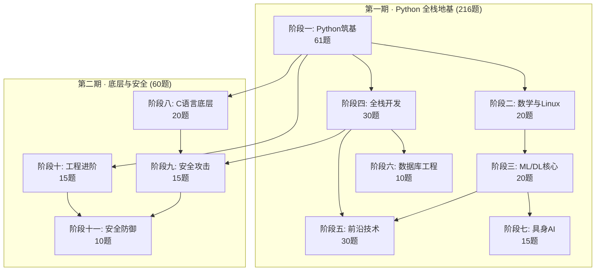
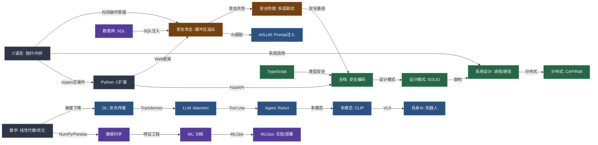

# AI 全栈学习知识体系图谱

> 276 道练习题 · 11 个阶段 · 2 期学习 · 6 大领域
> 
> 生成时间：2026-08-05

---

## 一、总览

### 1.1 学习全景图



### 1.2 六大能力域

| 能力域 | 核心阶段 | 题数 | 语言 | 关键产物 |
|--------|---------|------|------|---------|
| 🐍 Python 编程 | 一 | 61 | Python | OOP/异步/数据结构 |
| 📊 数学与数据科学 | 二 | 20 | Python | NumPy/Pandas/Matplotlib/数学 |
| 🤖 AI 与机器学习 | 三·五·七 | 65 | Python | ML/DL/LLM/Agent/多模态/具身 |
| 🌐 全栈与工程 | 四·六·十 | 55 | Python/TS | FastAPI/数据库/设计模式/系统设计 |
| 🔒 安全攻防 | 九·十一 | 25 | Python | 15种攻击 + 10层防御 |
| ⚙️ 底层系统 | 八 | 20 | C | 指针/内存/进程/socket/C-Python互操作 |

---

## 二、各阶段知识详情

### 阶段一：Python 筑基（61题）

**文件**: `01_oop_basics.py` + `01_oop_extensions.py` + `02_async_basics.py` + `02_async_extensions.py` + `03_data_structures.py` + `03_data_structures_extensions.py`

| 模块 | 知识点 |
|------|--------|
| OOP 核心 | 类与对象、继承与多态、魔法方法（`__str__`/`__eq__`/`__hash__`/`__iter__`/`__len__`/`__contains__`）、属性装饰器、抽象基类 |
| OOP 扩展 | 图书馆管理系统（完整CRUD）、`__eq__`/`__hash__` 对象比较、迭代器协议、上下文管理器 |
| 异步编程 | 协程、`await`、事件循环、`gather`、`Semaphore`、`Queue`、`async with` |
| 异步扩展 | 异步重试机制、异步爬虫调度器（`CrawlScheduler`）、并发会话管理（`AsyncCrawlerSession`） |
| 数据结构 | 单链表（增删改查+反转）、BST、树遍历 |
| 数据结构扩展 | 双向链表、循环链表、中序遍历迭代实现、堆与K路合并 |

### 阶段二：数学与 Linux（20题）

**文件**: `04_numpy_basics.py` ~ `08_linux_basics.py`

| 模块 | 知识点 |
|------|--------|
| NumPy | 数组创建、索引切片、运算、广播、线性代数、向量化、移动平均、图像处理、特征分解PCA、广播KNN |
| Pandas | Series、DataFrame、过滤选择、groupby聚合、merge/join、透视表、时间序列、数据清洗、apply/map、多级索引 |
| Matplotlib | 折线图、柱状图、散点图、直方图/箱线图、子图、热力图/相关矩阵、回归图、FacetGrid、自定义样式、Dashboard |
| 数学 | 线性代数（矩阵运算/特征值）、概率论、微积分与优化（梯度下降/数值梯度）、信息论（熵/互信息）、统计推断、SVD图像压缩、贝叶斯推断 |
| Linux | 文件操作、文本处理（awk/sed/grep）、权限管理、管道重定向、环境变量、Shell脚本、日志分析、crontab自动化、网络工具、Git CLI |

### 阶段三：ML/DL 核心（20题）

**文件**: `09_ml_basics.py` + `10_dl_basics.py`

| 模块 | 知识点 |
|------|--------|
| 机器学习 | 线性回归、逻辑回归、决策树、SVM、聚类（K-Means）/朴素贝叶斯、过拟合与正则化、网格搜索、特征工程、模型对比、从零实现 |
| 深度学习 | MLP从零实现（纯NumPy）、激活函数（sigmoid/ReLU/LeakyReLU）、反向传播算法、优化器（SGD/Momentum/Adam）、L2正则化与Dropout |

### 阶段四：全栈开发（30题）

**文件**: `11_fastapi_basics.py` + `12_database_basics.py` + `13_frontend_fullstack.py`

| 模块 | 知识点 |
|------|--------|
| FastAPI | 基础路由（GET/POST/路径参数/查询参数）、Pydantic请求体模型与验证、依赖注入（分层依赖+数据库会话）、中间件（CORS+请求日志+自定义Header） |
| 数据库 | SQLite原生SQL（建表+CRUD+聚合）、SQLAlchemy ORM（模型定义+CRUD）、关系映射（一对多+多对多）、高级查询（过滤/排序/分页/子查询/JOIN） |
| 前端全栈 | HTML语义化标签+表单+可访问性、CSS Flexbox+Grid+响应式+变量、JavaScript DOM操作+事件处理、Fetch API+Async/Await、React组件概念（函数组件+Hooks+Props）、Jinja2模板渲染（SSR） |

### 阶段五：前沿技术（30题）

**文件**: `14_llm_basics.py` ~ `19_cloud_platform.py`

| 模块 | 知识点 |
|------|--------|
| LLM 原理 | 位置编码（sin/cos）、Scaled Dot-Product Attention、Multi-Head Attention、Feed-Forward Network + Layer Normalization、Transformer架构 |
| Agent 架构 | Function Calling / Tool Use（工具注册+调度+执行）、ReAct模式（Reasoning+Acting）、Plan-and-Execute（任务规划与分解） |
| 多模态 | CLIP对比学习、CLIP零样本分类、SAM分割概念、Whisper语音识别（CTC解码/Beam Search）、多模态融合（Early/Late/Cross-Attention） |
| MLOps | 实验追踪（ExperimentTracker）、模型注册（ModelRegistry）、模型版本管理、阶段转换 |
| 容器部署 | Dockerfile生成与验证、多阶段构建、Kubernetes manifest生成、健康检查（Liveness/Readiness） |
| 云平台 | 云存储（S3-like）、Serverless函数、Serverless平台、自动扩缩容（HPA模拟） |

### 阶段六：数据库工程（10题）

**文件**: `20_database_engineering.py`

| 模块 | 知识点 |
|------|--------|
| 分布式数据库 | 雪花算法（Snowflake ID）、读写分离、主从复制模拟 |
| 数据管道 | 数据迁移与ETL管道、Airflow DAG编排（自研轻量框架） |
| 新型数据库 | 时序数据库、图数据库 |
| 数据治理 | DVC数据版本控制、Delta Lake/Iceberg（纯Python模拟）、特征存储（Feature Store）、数据质量监控（自研校验框架） |

### 阶段七：具身 AI（15题）

**文件**: `21_embodied_ai.py`

| 模块 | 知识点 |
|------|--------|
| 机器人学 | DH参数变换、正运动学、雅可比矩阵、逆运动学（迭代求解） |
| ROS2 | 节点、发布/订阅、服务、Action、生命周期节点（LifecycleNode） |
| 物理仿真 | 刚体物理模拟（RigidBodySim）、CartPole环境 |
| 强化学习 | 策略网络（PolicyNetwork）、价值网络（ValueNetwork）、PPO概念 |
| VLA 模型 | 简单CNN、语言嵌入器、动作头、动作Tokenizer、VLAModel、扩散策略（DiffusionPolicy）、OpenVLA模拟器、潜在动力学模型、导航环境 |

### 阶段八：C 语言底层基石（20题）

**文件**: `c_exercises/q01~q20` + 辅助文件

| 模块 | 题号 | 知识点 |
|------|------|--------|
| 基础语法 | Q1-Q5 | 数据类型/printf/scanf/类型转换、控制流/位运算/短路求值、函数/作用域/static/递归、数组/字符串/string.h/缓冲区溢出初探、预处理器/#define/#include/宏函数/gcc四阶段 |
| 指针与内存 | Q6-Q11 | 指针基础（取地址/解引用/NULL/void指针）、指针与数组（指针算术/数组名退化）、动态内存（malloc/calloc/realloc/free/内存泄漏）、函数指针与回调、字符串与指针、内存布局（代码段/数据段/BSS/堆/栈/段错误调试） |
| 结构化编程 | Q12-Q15 | 结构体与联合（嵌套/位域/union/枚举）、链表实战（单链表/双向/循环/内存池）、文件I/O（fopen/fread/fwrite/fseek）、多文件项目与Makefile（头文件分离/extern/static/静态库vs动态库） |
| 系统编程 | Q16-Q19 | 进程与exec（fork/exec/wait/僵尸进程/孤儿进程）、信号处理（sigaction/SIGINT/SIGTERM/信号屏蔽）、文件描述符与I/O重定向（open/read/write/dup/dup2/管道）、简易Web服务器（socket/bind/listen/accept/HTTP解析/并发） |
| C-Python 互操作 | Q20 | ctypes调用C编译的.so共享库 |

### 阶段九：安全攻击篇（15题）

**文件**: `python_exercises/23_security_attack.py`

> 按攻击共性4类组织，每题含 `attack()` + `defend()`

| 类别 | 题号 | 攻击类型 |
|------|------|---------|
| 输入信任崩塌 | Q1 | 注入本质（SQL注入/命令注入/SSTI） |
| | Q2 | 跨站攻击（反射型XSS/存储型XSS/CSRF） |
| | Q3 | 文件攻击（路径遍历/文件上传/内容操纵） |
| 身份权限失守 | Q5 | 认证绕过（身份伪造） |
| | Q6 | 授权突破（权限提升/JWT重放） |
| | Q7 | 会话劫持（状态窃取） |
| 逻辑配置缺陷 | Q4 | 解析器攻击（SSRF/JWT none算法/弱密钥破解） |
| | Q8 | 业务逻辑缺陷（规则绕过） |
| | Q9 | 信息泄露（暴露面） |
| | Q10 | 配置弱点（默认与疏忽） |
| 新型组合攻击 | Q11 | 供应链攻击（信任链断裂） |
| | Q12 | AI安全（LLM专属威胁：Prompt注入/数据投毒/模型窃取） |
| | Q13 | API安全（接口面攻击） |
| | Q14 | 运行时攻击（代码执行链） |
| | Q15 | 综合攻击链（漏洞组合） |

### 阶段十：工程进阶（15题）

**文件**: `python_exercises/24_design_patterns.py` + `25_system_design.py` + `ts_exercises/`

| 模块 | 题号 | 知识点 |
|------|------|--------|
| 创建型模式 | Q1 | 单例（线程安全连接池）、工厂方法（LLM Provider）、抽象工厂（UI跨平台）、建造者（LLM请求构建）、原型（配置克隆） |
| 结构型模式 | Q2 | 适配器（统一AI API）、装饰器（LLM调用增强）、代理（懒加载/缓存/权限）、外观（简化子系统）、组合（文件系统树） |
| 行为型模式 | Q3 | 策略（推荐算法切换）、观察者（事件总线）、责任链（请求处理链）、命令（撤销/重做）、状态（订单状态机） |
| SOLID 原则 | Q4 | SRP单一职责、OCP开闭原则、LSP里氏替换、ISP接口隔离、DIP依赖倒置 |
| Agent 设计模式 | Q5 | 工具注册器、ReAct循环、记忆管理、多Agent协作、工具链编排 |
| HLD 基础 | Q6 | 负载均衡（轮询/最少连接/一致性哈希）、缓存策略（CacheAside/WriteThrough）、CDN原理、数据分片、消息队列 |
| HLD 实战 | Q7 | AI推理服务设计、Bug Bounty平台设计 |
| LLD 与 SOLID | Q8 | 插件系统设计 |
| 分布式系统 | Q9 | CAP定理、BASE vs ACID、一致性哈希（虚拟节点）、Raft共识算法、分布式锁（Redis） |
| 容量规划 | Q10 | QPS估算（Little's Law）、性能瓶颈分析（排队论）、容量规划计算器、压测模拟、性能监控指标 |
| TypeScript 基础 | Q11 | 基本类型、接口、类型别名、联合/交叉类型、字面量类型、类型断言与守卫 |
| TS 泛型与高级类型 | Q12 | 泛型函数/接口/类、泛型约束、映射类型、条件类型、infer、内置工具类型 |
| TS + React | Q13 | Props类型、useState/useEffect类型、Context API类型安全、组件类型、自定义Hook类型 |
| TS + AI SDK | Q14 | 流式响应类型设计、工具调用类型设计、AI消息类型设计、完整AI SDK类型系统 |
| 全栈类型安全 | Q15 | 共享类型定义、API契约设计、Zod式运行时校验模拟、类型安全API客户端 |

### 阶段十一：安全防御篇（10题）

**文件**: `python_exercises/26_security_defense.py`

> 每题对应阶段九攻击共性，展示多层防御联动体系

| 题号 | 防御主题 | 联动机制 |
|------|---------|---------|
| Q1 | 输入验证与净化架构 | 参数化查询 + WAF规则 + 输出编码 + CSP 分层防御 |
| Q2 | 文件安全处理 | 白名单 + 沙箱隔离 + 路径规范化 + 内容检测（Magic Number） |
| Q3 | 解析器安全加固 | 禁用外部实体 + 严格CL/TE校验 + 缓存隔离 + DNS重绑定防护 |
| Q4 | 认证安全体系 | MFA + 密码策略 + 速率限制 + 异常检测 |
| Q5 | 授权架构设计 | RBAC/ABAC + 资源级校验 + 默认拒绝 + 审计日志 |
| Q6 | 会话安全工程 | 安全Cookie + CSRF Token + 会话轮换 + 异常终止 |
| Q7 | 业务逻辑防护 | 幂等性 + 分布式锁 + 事务完整性 + 异常监控 |
| Q8 | 信息泄露防护 | 最小暴露面 + 敏感数据处理 + 错误信息脱敏 |
| Q9 | 供应链与AI安全防御 | 依赖审计 + SBOM + Prompt注入防护 + 模型输入校验 |
| Q10 | 纵深防御体系 | 全链路防御编排 + 安全基线 + 应急响应 |

---

## 三、跨领域连接图



### 关键跨领域知识链

| 链名 | 路径 | 说明 |
|------|------|------|
| 🔗 内存安全链 | C指针/内存布局 → 缓冲区溢出 → 输入验证/CSP → Rust所有权（未学） | 从底层理解内存破坏，到攻防实践，再到现代语言的安全设计 |
| 🔗 AI 安全链 | LLM/Agent → Prompt注入/数据投毒 → AI安全防御 → 安全AI系统 | AI能力越强，攻击面越大，防御必须同步 |
| 🔗 全栈安全链 | FastAPI/Web → SQL注入/XSS/CSRF → 参数化查询/WAF/CSP → 安全编码规范 | Web开发的每个环节都有对应攻击和防御 |
| 🔗 数据→AI链 | 数学/NumPy → ML训练 → DL/Transformer → LLM/Agent → 具身AI | 从数学基础到最前沿AI的完整技术栈 |
| 🔗 工程化链 | Python OOP → 设计模式/SOLID → 系统设计 → 分布式系统 → 容量规划 | 从写代码到设计系统的成长路径 |
| 🔗 C-Python链 | C语言 → ctypes → Python C扩展 → 高性能计算 | 底层语言与高级语言的互操作 |
| 🔗 TS全栈链 | TypeScript → React类型 → AI SDK类型 → 全栈类型安全 | 类型系统贯穿前后端 |

---

## 四、能力评估矩阵

| 能力域 | 知识广度 | 实践深度 | 关联度 | 综合评级 |
|--------|---------|---------|--------|---------|
| Python 编程 | ★★★★★ | ★★★★☆ | 核心 | A |
| 数学与数据科学 | ★★★★☆ | ★★★★☆ | 高 | A- |
| ML/DL | ★★★★☆ | ★★★☆☆ | 高 | B+ |
| LLM/Agent | ★★★★☆ | ★★★☆☆ | 高 | B+ |
| 多模态/具身AI | ★★★☆☆ | ★★☆☆☆ | 中 | B |
| 全栈开发 | ★★★★☆ | ★★★☆☆ | 高 | B+ |
| 数据库 | ★★★★☆ | ★★★☆☆ | 高 | B+ |
| C 语言底层 | ★★★★☆ | ★★★☆☆ | 中 | B+ |
| 安全攻防 | ★★★★★ | ★★★★☆ | 高 | A |
| 设计模式/系统设计 | ★★★★☆ | ★★★☆☆ | 高 | B+ |
| TypeScript | ★★★☆☆ | ★★☆☆☆ | 中 | B |
| 容器/云/DevOps | ★★★☆☆ | ★★☆☆☆ | 中 | B- |
| MLOps | ★★☆☆☆ | ★★☆☆☆ | 中 | B- |

> 评级标准：A=可独立产出，B+=能做项目，B=理解原理可协作，B-=概念掌握待实践

---

## 五、缺口分析

基于编程方向全景调研（17个方向），对比当前已学内容：

### 已覆盖（12/17 方向）

| 方向 | 覆盖阶段 | 深度 |
|------|---------|------|
| 前端开发 | 四 | 基础（HTML/CSS/JS/React概念） |
| 后端开发 | 四·六 | 中等（FastAPI/数据库/SQLAlchemy） |
| 全栈开发 | 四·十 | 中等（前后端+TS类型安全） |
| AI/ML 开发 | 三·五 | 中等（ML/DL/LLM/Agent纯NumPy实现） |
| 数据工程 | 六 | 中等（ETL/DAG/特征存储/数据质量） |
| 数据分析/BI | 二 | 基础（Pandas/Matplotlib） |
| 云原生/DevOps | 五 | 基础（Docker概念/K8s manifest/健康检查） |
| 网络安全 | 九·十一 | 深入（15种攻击+10层防御联动） |
| 嵌入式/IoT | 八·七 | 基础（C语言+ROS2概念+物理仿真） |
| 系统编程 | 八 | 基础（C语言/进程/信号/socket） |
| 系统架构 | 十 | 中等（HLD/LLD/分布式/容量规划） |
| 测试开发 | 一·十 | 基础（断言/设计模式中的测试概念） |

### 未覆盖（5/17 方向）

| 方向 | 缺口 | 建议补全批次 |
|------|------|-------------|
| 移动端开发 | Kotlin/Swift/Flutter/RN | 第五批之后 |
| 区块链/Web3 | Solidity/智能合约/DeFi | 第五批 |
| 游戏开发 | C++/Unity/Unreal/图形学 | 第四批 |
| 低代码/无代码 | 平台使用（非核心编程） | 不优先 |
| 系统架构师(高级) | 需5-10年实战沉淀 | 长期积累 |

### 已学但待深化

| 方向 | 当前状态 | 深化建议 |
|------|---------|---------|
| Rust/Go | 未学 | 第三批优先（Rust内存安全+Go云原生） |
| TypeScript 全栈 | 概念级 | 第四批（实际项目开发） |
| 嵌入式 IoT | C基础+ROS2概念 | 第四批（ARM/RTOS/传感器） |
| 容器/云原生 | 概念级 | 第五批（实际K8s/Terraform） |
| MLOps | 概念级 | 可融入综合项目实践 |

---

## 六、后续路径建议

### 6.1 知识图谱驱动的学习优先级

```
当前能力 ████████████████░░░░░░ 70%

第三批 (P0): Rust → Go → 系统设计进阶     预估 +40~50题
第四批 (P1): TS全栈 → 嵌入式IoT → 游戏开发  预估 +40题
第五批 (P2): 区块链 → 数据工程进阶 → 云原生  预估 +30题

全部完成后 ████████████████████████ 95%+
累计预估: ~396题
```

### 6.2 从"会做"到"会用"的关键转变

| 阶段 | 特征 | 当前位置 |
|------|------|---------|
| 散点练习 | 单个知识点独立练习 | ✅ 已完成 (276题) |
| 知识图谱 | 理解知识点间关联 | ← 当前 |
| 综合项目 | 跨领域知识整合应用 | 下一步 |
| 开源贡献 | 面向真实用户和社区 | 未来 |
| 技术输出 | 博客/教程/演讲 | 未来 |

### 6.3 推荐的第一个综合项目

**安全审计 Agent** — 能同时调用最多已学知识：

```
输入: 代码文件
  ↓
[Python 解析] → AST 分析（阶段一 OOP + 数据结构）
  ↓
[规则引擎] → 匹配攻击模式（阶段九 15种攻击）
  ↓
[C 语言扫描] → 内存安全检查（阶段八 指针/内存）
  ↓
[AI 判断] → LLM 辅助分析（阶段五 Agent/LLM）
  ↓
[防御建议] → 生成修复方案（阶段十一 防御联动）
  ↓
[报告生成] → 结构化输出（阶段十 系统设计）
```

覆盖：Python + C + 安全攻防 + AI/Agent + 系统设计 = **6个阶段的知识联动**

---

## 附录：文件索引

| 阶段 | 文件路径 | 行数 | 语言 |
|------|---------|------|------|
| 一 | `python_exercises/01~03_*.py` | ~3000 | Python |
| 二 | `python_exercises/04~08_*.py` | ~2500 | Python |
| 三 | `python_exercises/09~10_*.py` | ~1500 | Python |
| 四 | `python_exercises/11~13_*.py` | ~2000 | Python |
| 五 | `python_exercises/14~19_*.py` | ~3000 | Python |
| 六 | `python_exercises/20_*.py` | ~1200 | Python |
| 七 | `python_exercises/21_*.py` | ~1500 | Python |
| 八 | `c_exercises/q01~q20*` | 3304 | C |
| 九 | `python_exercises/23_*.py` | 1425 | Python |
| 十 | `python_exercises/24~25_*.py` + `ts_exercises/` | 4653 | Python/TS |
| 十一 | `python_exercises/26_*.py` | 2399 | Python |

**GitHub**: https://github.com/Z4OR-cyber/ai-fullstack-lab  
**最新 commit**: `7929303` (2026-08-05)  
**累计**: 276/276 题
